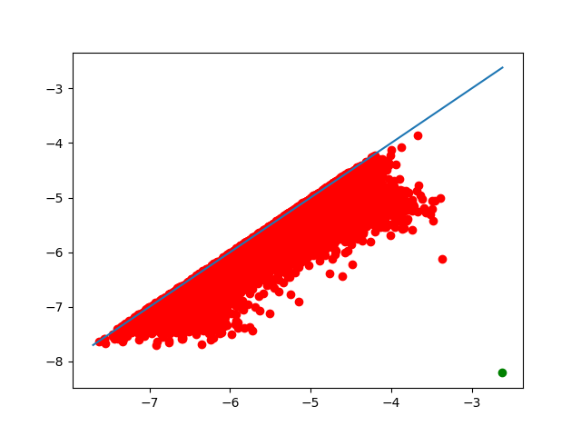
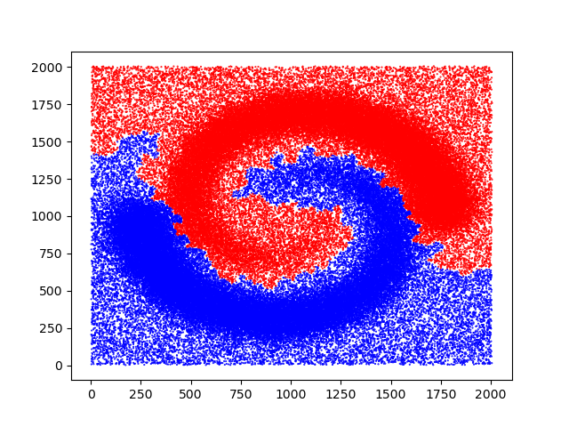
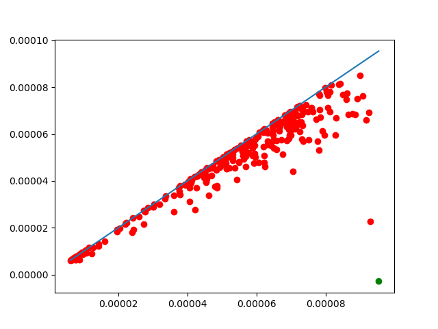
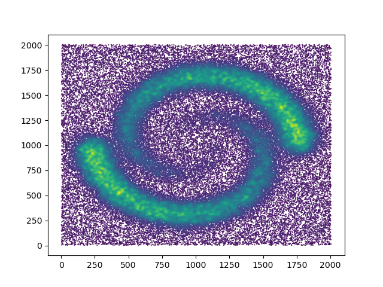

:orphan:

.. To get rid of WARNING: document isn't included in any toctree

=================
Clustering manual
=================

We provide an implementation of ToMATo :cite:`tomato`, a persistence-based clustering algorithm. In short, this algorithm uses a density estimator and a neighborhood graph, starts with a mode-seeking phase (naive hill-climbing) to build initial clusters, and finishes by merging clusters based on their prominence.

The merging phase depends on a parameter, which is the minimum prominence a cluster needs to avoid getting merged into another, bigger cluster. This parameter determines the number of clusters, and for convenience we allow you to choose instead the number of clusters. Decreasing the prominence threshold defines a hierarchy of clusters: if 2 points are in separate clusters when we have k clusters, they are still in different clusters for k+1 clusters.

As a by-product, we produce the persistence diagram of the merge tree of the initial clusters. This is a convenient graphical tool to help decide how many clusters we want.

.. code-block::

   import gudhi
   f = open(gudhi.__root_source_dir__ + '/data/points/spiral_2d.csv', 'r')
   import numpy as np
   data = np.loadtxt(f)
   import matplotlib.pyplot as plt
   plt.scatter(data[:,0],data[:,1],marker='.',s=1)
   plt.show()

.. image:: img/spiral.png

.. code-block::

   from gudhi.clustering.tomato import Tomato
   t = Tomato()
   t.fit(data)
   t.plot_diagram()

As one can see in `t.n_clusters_`, the algorithm found 6316 initial clusters. The diagram shows their prominence as their distance to the diagonal. There is always one point infinitely far: there is at least one cluster. Among the others, one point seems significantly farther from the diagonal than the others, which indicates that splitting the points into 2 clusters may be a sensible idea.

.. code-block::

   t.n_clusters_=2
   plt.scatter(data[:,0],data[:,1],marker='.',s=1,c=["r" if i else "b" for i in t.labels_])
   plt.show()

Of course this is just the result for one set of parameters. We can ask for a different density estimator and a different neighborhood graph computed with different parameters.

.. code-block::

   t = Tomato(density_type='DTM', k=100)
   t.fit(data)
   t.plot_diagram()

Makes the number of clusters clearer, and changes a bit the shape of the clusters.

A quick look at the corresponding density estimate

.. code-block::

   plt.scatter(data[:,0],data[:,1],marker='.',s=1,c=t.weights_)
   plt.show()

The code provides a few density estimators and graph constructions for convenience when first experimenting, but it is actually expected that advanced users provide their own graph and density estimates instead of point coordinates.

Since the algorithm essentially computes basins of attraction, it is also encouraged to use it on functions that do not represent densities at all.

.. autoclass:: gudhi.clustering.tomato.Tomato
   :members:
   :special-members: __init__
