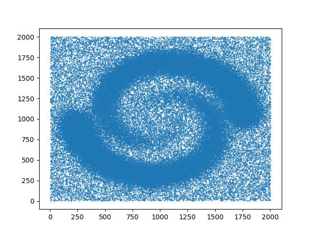

:orphan:

.. To get rid of WARNING: document isn't included in any toctree

================
Datasets manual
================

Datasets generators
===================

We provide the generation of different customizable datasets to use as inputs for Gudhi complexes and data structures.

Points generators
------------------

The module **points** enables the generation of random points on a sphere, random points on a torus and as a grid.

Points on sphere
^^^^^^^^^^^^^^^^

The function **sphere** enables the generation of random i.i.d. points uniformly on a (d-1)-sphere in :math:`R^d`.
The user should provide the number of points to be generated on the sphere :code:`n_samples` and the ambient dimension :code:`ambient_dim`.
The :code:`radius` of sphere is optional and is equal to **1** by default.
Only random points generation is currently available.

The generated points are given as an array of shape :math:`(n\_samples, ambient\_dim)`.

Example
"""""""

.. code-block:: python

   from gudhi.datasets.generators import points
   from gudhi import AlphaComplex

   # Generate 50 points on a sphere in R^2
   gen_points = points.sphere(n_samples = 50, ambient_dim = 2, radius = 1, sample = "random")

   # Create an alpha complex from the generated points
   alpha_complex = AlphaComplex(points = gen_points)
   
.. autofunction:: gudhi.datasets.generators.points.sphere

Points on a flat torus
^^^^^^^^^^^^^^^^^^^^^^

You can also generate points on a torus.

Two functions are available and give the same output: the first one depends on **CGAL** and the second does not and consists of full python code.

On another hand, two sample types are provided: you can either generate i.i.d. points on a d-torus in :math:`R^{2d}` *randomly* or on a *grid*.

First function: **ctorus**
"""""""""""""""""""""""""""

The user should provide the number of points to be generated on the torus :code:`n_samples`, and the dimension :code:`dim` of the torus on which points would be generated in :math:`R^{2dim}`.
The :code:`sample` argument is optional and is set to **'random'** by default.
In this case, the returned generated points would be an array of shape :math:`(n\_samples, 2*dim)`.
Otherwise, if set to **'grid'**, the points are generated on a grid and would be given as an array of shape:

.. math::

   ( ⌊n\_samples^{1 \over {dim}}⌋^{dim}, 2*dim )

**Note 1:** The output array first shape is rounded down to the closest perfect :math:`dim^{th}` power.

**Note 2:** This version is recommended when the user wishes to use **'grid'** as sample type, or **'random'** with a relatively small number of samples (~ less than 150).

Example
"""""""
.. code-block:: python

   from gudhi.datasets.generators import points

   # Generate 50 points randomly on a torus in R^6
   gen_points = points.ctorus(n_samples = 50, dim = 3)
   
   # Generate 27 points on a torus as a grid in R^6
   gen_points = points.ctorus(n_samples = 50, dim = 3, sample = 'grid')

.. autofunction:: gudhi.datasets.generators.points.ctorus

Second function: **torus**
"""""""""""""""""""""""""""

The user should provide the number of points to be generated on the torus :code:`n_samples` and the dimension :code:`dim` of the torus on which points would be generated in :math:`R^{2dim}`.
The :code:`sample` argument is optional and is set to **'random'** by default.
The other allowed value of sample type is **'grid'**.

**Note:** This version is recommended when the user wishes to use **'random'** as sample type with a great number of samples and a low dimension.

Example
"""""""
.. code-block:: python

   from gudhi.datasets.generators import points

   # Generate 50 points randomly on a torus in R^6
   gen_points = points.torus(n_samples = 50, dim = 3)
   
   # Generate 27 points on a torus as a grid in R^6
   gen_points = points.torus(n_samples = 50, dim = 3, sample = 'grid')

.. autofunction:: gudhi.datasets.generators.points.torus

Fetching datasets
=================

We provide some ready-to-use datasets that are not available by default when getting GUDHI, and need to be fetched explicitly.

By **default**, the fetched datasets directory is set to a folder named **'gudhi_data'** in the **user home folder**.
Alternatively, it can be set using the **'GUDHI_DATA'** environment variable.

.. autofunction:: gudhi.datasets.remote.fetch_bunny

     3D Stanford bunny with 35947 vertices.

.. autofunction:: gudhi.datasets.remote.fetch_spiral_2d

     2D spiral with 114562 vertices.

.. autofunction:: gudhi.datasets.remote.fetch_daily_activities

.. autofunction:: gudhi.datasets.remote.clear_data_home
