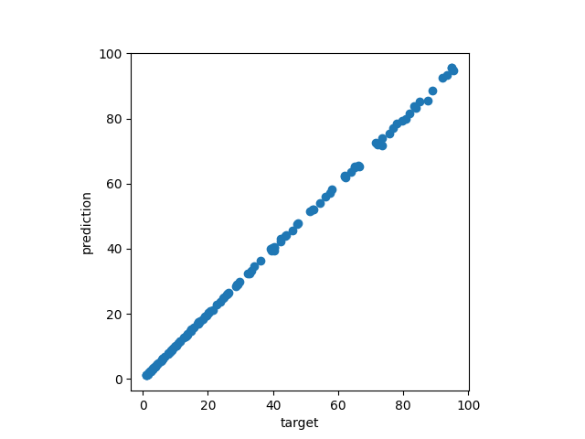

:orphan:

.. To get rid of WARNING: document isn't included in any toctree

Čech complex persistence scikit-learn like interface
####################################################

.. list-table::
   :width: 100%
   :header-rows: 0

   * - :Since: GUDHI 3.11.0
     - :License: MIT
     - :Requires: `Scikit-learn <installation.html#scikit-learn>`_

Čech complex persistence scikit-learn like interface example
------------------------------------------------------------

In this example, we build a dataset `X` composed of 500 circles of radius randomly between 1.0 and 10.0.
N points are subsampled randomly on each circle, where N randomly between 100 and 300 for each circle.
In order to complicate things, some noise (+/- 5% of the radius value) to the point coordinates.

The TDA scikit-learn pipeline is constructed and is composed of:

#. :class:`~gudhi.sklearn.cech_persistence.CechPersistence` that builds a Čech complex from the inputs and
   returns its persistence diagrams in dimension 1.
#. :class:`~gudhi.representations.vector_methods.PersistenceLengths` that returns here the biggest persistence bar in
   dimension 1.
#. `LinearRegression <https://scikit-learn.org/stable/modules/generated/sklearn.linear_model.LinearRegression.html>`_
   an ordinary least squares Linear Regression from scikit-learn.

The model is trained with the squared radiuses of each circles and 75% of the dataset, and you can appreciate the
regression line of the model when fitting on the other 25% of the dataset.

.. literalinclude:: ../../python/example/cech_complex_sklearn_itf.py
   :lines: 1-15,22-
   :language: python

     Regression line of the model

Čech complex persistence scikit-learn like interface reference
--------------------------------------------------------------

.. autoclass:: gudhi.sklearn.cech_persistence.CechPersistence
   :members:
   :show-inheritance:

.. autoclass:: gudhi.sklearn.cech_persistence.WeightedCechPersistence
   :members:
   :show-inheritance:

.. autoclass:: gudhi.sklearn.rips_persistence.RipsPersistence
   :members:
   :show-inheritance:
