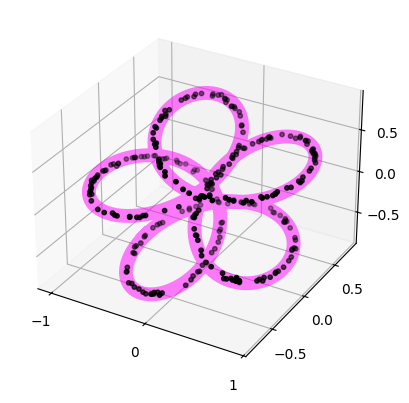
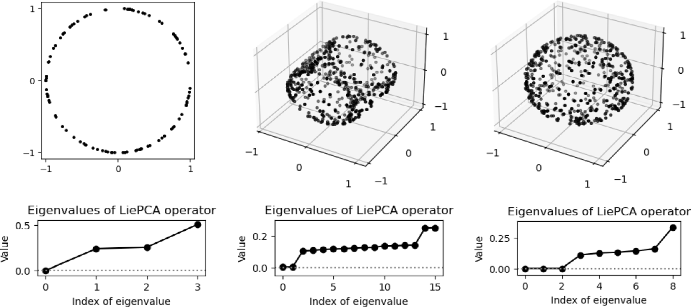

:orphan:

.. To get rid of WARNING: document isn't included in any toctree

LieDetect user manual
=====================

.. include:: liedetect_sum.inc

A representation of a Lie group :math:`G` on :math:`\mathbb{R}^n` is a group homomorphism
:math:`\rho:G\to GL(n,\mathbb{R})` mapping each group element to a :math:`n\times n` real matrix.

Given a point :math:`x_0\in\mathbb{R}^n`, its orbit under the representation is the set of points
:math:`x` such that :math:`\rho(g)\cdot x_0 = x` for some :math:`g\in G`.

The representation is called irreducible if :math:`\mathbb{R}^n` has no non-trivial subspaces invariant
under the representation. If :math:`G` is a compact Lie group, any finite-dimensional representation
can be decomposed as a direct sum of irreducible representations. The multiset of parameters
characterizing this decomposition is called the representation type of :math:`\rho`.

Given a point cloud :math:`\{x_i\}` lying on or close to an orbit of a representation
:math:`\rho(g)` of the compact Lie groups :math:`SO(2)`, :math:`T^d`, :math:`SO(3)`,
or :math:`SU(2)`, `LieDetect [Ennes and Tinarrage, 2025]
<https://link.springer.com/article/10.1007/s10208-025-09728-4>`_ estimates the representation
:math:`\rho(g)` in terms of its representation type. This estimate allows reconstruction of the
representation orbit. The algorithm consists of four steps, described below and
detailed in the paper.

   Samples along a :math:`SO(2)` representation orbit in :math:`\mathbb{R}^4`,
   projected to :math:`\mathbb{R}^3` for visualization.

Step 1: Orthonormalization
--------------------------

Every representation of a compact Lie group can be made orthogonal. That is,
there exists a change of basis of :math:`\mathbb{R}^n` for which the orbit lies
on the unit sphere. The first step of LieDetect estimates such a change of basis.

This step is implemented by the :class:`~gudhi.liedetect.Orthonormalize` class.

.. code-block:: python

    from gudhi.liedetect import Orthonormalize

    ortho = Orthonormalize(pts)
    pts = ortho.fit_transform(pts)

This operation is not equivalent to the usual radial projection onto the sphere
obtained by normalization.

Step 2: LiePCA
--------------

The second step uses the LiePCA algorithm of :cite:`cahill2023lie`. Tangent information along
the orbit is used to compute an operator approximating the infinitesimal action
of the representation (i.e., the associated Lie algebra representation).

This functionality is provided by the :class:`~gudhi.liedetect.OrbitFitter` class.

.. code-block:: python

    orbit_fitter = OrbitFitter(pts=pts)
    lie_pca = orbit_fitter.lie_pca(
        nb_neighbors=nb_neighbors,
        orbit_dim=orbit_dim,
    )

The number of eigenvalues of the LiePCA operator that are close to zero
roughly corresponds to the dimension of the Lie group generating the orbit.

They can be displayed with

.. code-block:: python

    orbit_fitter.print_lie_pca_eigenvalues()

For example, if the output is

.. code-block:: none

    Lie PCA first eigenvalues: 3.0e-04  1.2e-01  1.4e-01  2.4e-01

the orbit is likely generated by a Lie group of dimension 1.

   LiePCA eigenvalues for groups of dimension 1, 2, and 3, respectively.

Step 3: Optimization
--------------------

In this step, the estimated infinitesimal representation is projected onto the
closest algebra compatible with a valid representation type.

.. code-block:: python

    _, _ = orbit_fitter.closest_algebra(
        group=group,
        group_dim=group_dim,
        frequency_max=frequency_max,
        method=method,
        verbose=True,
    )

The decomposition of a representation into representation types may not be unique.
The following function checks whether two representation types are equivalent.

.. code-block:: python

    are_representations_equivalent(
        group,
        groundtruth_rep,
        orbit_fitter.representation_type_,
    )

Step 4: Generate orbit and compute Hausdorff distances
------------------------------------------------------

Once the representation type has been estimated, the corresponding orbit can
be reconstructed.

.. code-block:: python

    reconstructed_orbit = orbit_fitter.sample_orbit(nb_points=30**3)

The non-symmetric Hausdorff distances between the reconstructed orbit and the
input point cloud often provide a useful indicator of convergence.

.. code-block:: python

    print("Hausdorff distances:", orbit_fitter.hausdorff_distances_)

Generate synthetic data
-----------------------

LieDetect also provides functions to generate synthetic data near orbits of
representations.

.. code-block:: python

    from gudhi.datasets.linear_orbits import (
        sample_orbit_from_group,
        sample_orbit_from_rep,
    )

    # Choose the Lie group
    pts = sample_orbit_from_group(
        group="torus",
        ambient_dim=4,
        nb_points=100,
        group_dim=1,
    )

    # Choose the representation type
    pts = sample_orbit_from_rep(
        group="torus",
        rep_type=((1, 2),),
        nb_points=100,
        method=method,
    )

Simple example
--------------

The example below illustrates a typical use of LieDetect. Points are sampled
near an orbit of a representation of :math:`SO(3)`, and the four steps of the
algorithm are applied to recover the representation type.

.. code-block:: python

    from gudhi.liedetect import OrbitFitter, Orthonormalize
    from gudhi.datasets.linear_orbits import sample_orbit_from_group

    # Input
    pts = sample_orbit_from_group(
        group="SO(3)",
        ambient_dim=5,
        nb_points=3000,
        group_dim=3,
    )

    # Step 1: Orthonormalization
    ortho = Orthonormalize(pts)
    pts = ortho.fit_transform(pts)

    # Step 2: Lie PCA
    orbit_fitter = OrbitFitter(pts=pts)
    lie_pca = orbit_fitter.lie_pca(
        nb_neighbors=50,
        orbit_dim=3,
    )

    # Step 3: Optimization
    _, _ = orbit_fitter.closest_algebra(
        group="SO(3)",
        group_dim=3,
        method="bottom_lie_pca",
    )

    # Step 4: Reconstruct orbit and compute Hausdorff distances
    orbit = orbit_fitter.sample_orbit(
        nb_points=30**3,
        method="uniform",
    )

    print("Hausdorff distances:", orbit_fitter.hausdorff_distances_)