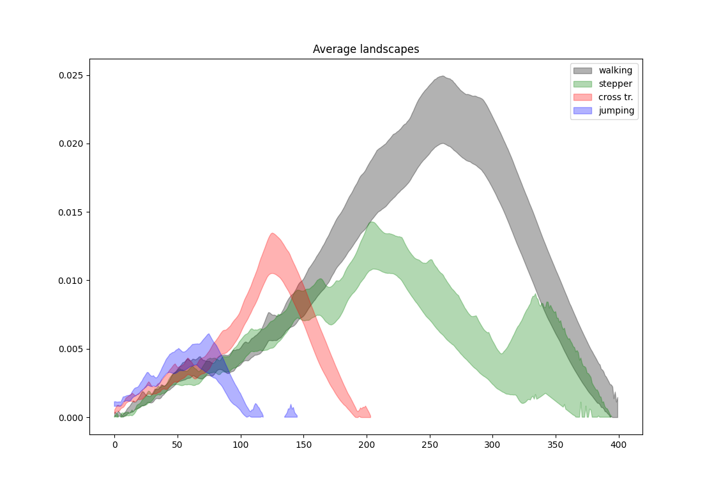

:orphan:

.. To get rid of WARNING: document isn't included in any toctree

Rips complex persistence scikit-learn like interface
####################################################

.. list-table::
   :width: 100%
   :header-rows: 0

   * - :Since: GUDHI 3.7.0
     - :License: MIT
     - :Requires: `Scikit-learn <installation.html#scikit-learn>`_

Rips complex persistence scikit-learn like interface example
------------------------------------------------------------

a TDA scikit-learn pipeline is constructed and is composed of:

#. :class:`~gudhi.sklearn.rips_persistence.RipsPersistence` that builds a Rips complex from the inputs and
   returns its persistence diagrams
#. :class:`~gudhi.representations.preprocessing.DiagramSelector` that removes non-finite persistence diagrams values
#. :class:`~gudhi.representations.vector_methods.Landscape` that builds the persistence landscapes from persistence diagrams
#. `bootstrap <https://docs.scipy.org/doc/scipy/reference/generated/scipy.stats.bootstrap.html>`_ that computes a two-sided
    bootstrap confidence interval of a statistic.

The example below has been taken from the publication "Subsampling Methods for Persistent Homology" :cite:`icml2014`,
the one with magnetometer data from different activities.
For each activity, 7500 consecutive measurements are considered as a 3D point cloud in the Euclidean space.
Each activity is subsampled as a series of 80, that each contains 200 points.

a TDA scikit-learn pipeline is constructed and is composed of:

#. :class:`~gudhi.sklearn.rips_persistence.RipsPersistence` that builds a Rips complex from the inputs and
   returns its persistence diagrams
#. :class:`~gudhi.representations.preprocessing.DiagramSelector` that removes non-finite persistence diagrams values
#. :class:`~gudhi.representations.vector_methods.Landscape` that builds the persistence landscapes from persistence diagrams

Finally, a `bootstrap method <https://docs.scipy.org/doc/scipy/reference/generated/scipy.stats.bootstrap.html>`_
(that computes a two-sided bootstrap confidence interval of a statistic) from scipy is used to compute the confidence
intervals for each activity. Note this bootstrap method is not exactly the one used in the paper, the multiplier
bootstrap cited in the paper :cite:`icml2014`.

These confidence intervals are displayed, and one can see that it is possible to distinguish human
activities performed while wearing only magnetic sensor unit on the left leg.

.. code-block:: python

    # Standard data science imports
    import numpy as np
    from scipy.stats import bootstrap
    from sklearn.pipeline import Pipeline
    import matplotlib.pyplot as plt
    
    # Import TDA pipeline requirements
    from gudhi.sklearn.rips_persistence import RipsPersistence
    from gudhi.representations import DiagramSelector, Landscape
    # To fetch the dataset
    from gudhi.datasets import remote
    
    # constants for subsample
    nb_times = 80
    nb_points = 200
    
    def subsample(array):
        sub = []
        # construct a list of nb_times x nb_points
        for sub_idx in range(nb_times):
            sub.append(array[np.random.choice(array.shape[0], nb_points, replace=False)])
        return sub
    
    # constant for plot_average_landscape
    landscape_resolution = 1000
    # Nothing interesting after 0.4, you can set this filter to 1 (number of landscapes) if you want to check
    filter = int(0.4 * landscape_resolution)
    
    def plot_average_landscape(landscapes, color, label):
        landscapes = landscapes[:,:filter]
        rng = np.random.default_rng()
        res = bootstrap((np.transpose(landscapes),), np.std, axis=-1, confidence_level=0.95, random_state=rng)
        ci_l, ci_u = res.confidence_interval
        plt.fill_between(np.arange(0,filter,1), ci_l, ci_u, alpha=.3, color=color, label=label)
    
    walking_ds = remote.fetch_daily_activities(subset="walking")
    walking = subsample(walking_ds)
    
    stepper_ds = remote.fetch_daily_activities(subset="stepper")
    stepper = subsample(stepper_ds)
    
    cross_ds = remote.fetch_daily_activities(subset="cross_training")
    cross = subsample(cross_ds)
    
    jumping_ds = remote.fetch_daily_activities(subset="jumping")
    jumping = subsample(jumping_ds)
    
    pipe = Pipeline(
        [
            ("rips_pers", RipsPersistence(homology_dimensions=1, n_jobs=-2)),
            ("finite_diags", DiagramSelector(use=True, point_type="finite")),
            ("landscape", Landscape(num_landscapes=1,resolution=landscape_resolution)),
        ]
    )
    
    walking_landscapes = pipe.fit_transform(walking)
    plot_average_landscape(walking_landscapes, 'black', 'walking')
    
    stepper_landscapes = pipe.fit_transform(stepper)
    plot_average_landscape(stepper_landscapes, 'green', 'stepper')
    
    cross_landscapes = pipe.fit_transform(cross)
    plot_average_landscape(cross_landscapes, 'red', 'cross tr.')
    
    jumping_landscapes = pipe.fit_transform(jumping)
    plot_average_landscape(jumping_landscapes, 'blue', 'jumping')
    
    plt.title('Average landscapes')
    plt.legend()
    plt.show()

     Average Landscapes of 4 different activities.

Rips complex persistence scikit-learn like interface reference
-----------------------------------------------------------------

.. autoclass:: gudhi.sklearn.rips_persistence.RipsPersistence
   :members:
   :special-members: __init__
   :show-inheritance: