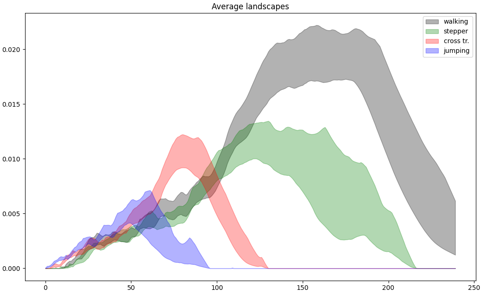

:orphan:

.. To get rid of WARNING: document isn't included in any toctree

Rips complex persistence scikit-learn like interface
####################################################

.. list-table::
   :width: 100%
   :header-rows: 0

   * - :Since: GUDHI 3.10.0
     - :License: MIT
     - :Requires: `Scikit-learn <installation.html#scikit-learn>`_

Rips complex persistence scikit-learn like interface example
------------------------------------------------------------

The example below has been taken from the publication "Subsampling Methods for Persistent Homology" :cite:`icml2014`,
the one with magnetometer data from different activities.
For each activity, 7500 consecutive measurements are considered as a 3D point cloud in the Euclidean space.
For `nb_times = 80` times, we subsample `nb_points = 200` points from the point cloud of each activity.

The TDA scikit-learn pipeline is constructed and is composed of:

#. :class:`~gudhi.sklearn.RipsPersistence` that builds a Rips complex from the inputs and
   returns its persistence diagrams
#. :class:`~gudhi.representations.preprocessing.DiagramSelector` that removes non-finite persistence diagrams values
#. :class:`~gudhi.representations.vector_methods.Landscape` that builds the persistence landscapes from persistence diagrams

Finally, a `bootstrap method <https://docs.scipy.org/doc/scipy/reference/generated/scipy.stats.bootstrap.html>`_
(that computes a two-sided bootstrap confidence interval of a statistic) from scipy is used to compute the confidence
intervals for each activity. Note this bootstrap method is not exactly the one used in the paper, the multiplier
bootstrap cited in the paper :cite:`icml2014`.

These confidence intervals are displayed, and one can see that it is possible to distinguish human
activities performed while wearing only magnetic sensor unit on the left leg.

.. literalinclude:: ../../python/example/rips_complex_sklearn_itf.py
   :lines: 1-14,22-
   :language: python

     Average Landscapes of 4 different activities.

Rips complex persistence scikit-learn like interface reference
--------------------------------------------------------------

.. autoclass:: gudhi.sklearn.RipsPersistence
   :members:
   :show-inheritance:
