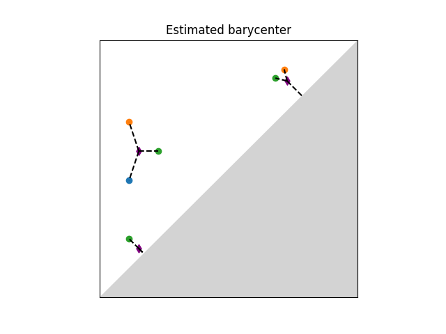

:orphan:

.. To get rid of WARNING: document isn't included in any toctree

Wasserstein distance user manual
================================
Definition
----------

.. include:: wasserstein_distance_sum.inc

The q-Wasserstein distance is defined as the minimal value achieved
by a perfect matching between the points of the two diagrams (+ all
diagonal points), where the value of a matching is defined as the
q-th root of the sum of all edge lengths to the power q. Edge lengths
are measured in norm p, for :math:`1 \leq p \leq \infty`.

Distance Functions
------------------

Optimal Transport
*****************

:Requires: `Python Optimal Transport <installation.html#python-optimal-transport>`_ (POT) :math:`\geq` 0.5.1 

This first implementation uses the `Python Optimal Transport <installation.html#python-optimal-transport>`_
library and is based on ideas from "Large Scale Computation of Means and Cluster for Persistence
Diagrams via Optimal Transport" :cite:`10.5555/3327546.3327645`.

.. autofunction:: gudhi.wasserstein.wasserstein_distance

Hera
****

This other implementation comes from `Hera
<https://bitbucket.org/grey_narn/hera/src/master/>`_ (BSD-3-Clause) which is
based on "Geometry Helps to Compare Persistence Diagrams"
:cite:`Kerber:2017:GHC:3047249.3064175` by Michael Kerber, Dmitriy
Morozov, and Arnur Nigmetov.

.. autofunction:: gudhi.hera.wasserstein_distance

Basic example
*************

This example computes the 1-Wasserstein distance from 2 persistence diagrams with Euclidean ground metric.
Note that persistence diagrams must be submitted as (n x 2) numpy arrays and must not contain inf values.

.. testcode::

    import gudhi.wasserstein
    import numpy as np

    dgm1 = np.array([[2.7, 3.7],[9.6, 14.],[34.2, 34.974]])
    dgm2 = np.array([[2.8, 4.45],[9.5, 14.1]])

    message = "Wasserstein distance value = " + '%.2f' % gudhi.wasserstein.wasserstein_distance(dgm1, dgm2, order=1., internal_p=2.)
    print(message)

The output is:

.. testoutput::

    Wasserstein distance value = 1.45

We can also have access to the optimal matching by letting `matching=True`.
It is encoded as a list of indices (i,j), meaning that the i-th point in X
is mapped to the j-th point in Y.
An index of -1 represents the diagonal.

.. testcode::

    import gudhi.wasserstein
    import numpy as np

    dgm1 = np.array([[2.7, 3.7],[9.6, 14.],[34.2, 34.974]])
    dgm2 = np.array([[2.8, 4.45], [5, 6], [9.5, 14.1]])
    cost, matchings = gudhi.wasserstein.wasserstein_distance(dgm1, dgm2, matching=True, order=1, internal_p=2)

    message_cost = "Wasserstein distance value = %.2f" %cost
    print(message_cost)
    dgm1_to_diagonal = matchings[matchings[:,1] == -1, 0]
    dgm2_to_diagonal = matchings[matchings[:,0] == -1, 1]
    off_diagonal_match = np.delete(matchings, np.where(matchings == -1)[0], axis=0)

    for i,j in off_diagonal_match:
        print("point %s in dgm1 is matched to point %s in dgm2" %(i,j))
    for i in dgm1_to_diagonal:
        print("point %s in dgm1 is matched to the diagonal" %i)
    for j in dgm2_to_diagonal:
        print("point %s in dgm2 is matched to the diagonal" %j)

The output is:

.. testoutput::

    Wasserstein distance value = 2.15
    point 0 in dgm1 is matched to point 0 in dgm2
    point 1 in dgm1 is matched to point 2 in dgm2
    point 2 in dgm1 is matched to the diagonal
    point 1 in dgm2 is matched to the diagonal

Barycenters
-----------

:Requires: `Python Optimal Transport <installation.html#python-optimal-transport>`_ (POT) :math:`\geq` 0.5.1 

A Frechet mean (or barycenter) is a generalization of the arithmetic
mean in a non linear space such as the one of persistence diagrams.
Given a set of persistence diagrams :math:`\mu_1 \dots \mu_n`, it is
defined as a minimizer of the variance functional, that is of
:math:`\mu \mapsto \sum_{i=1}^n d_2(\mu,\mu_i)^2`.
where :math:`d_2` denotes the Wasserstein-2 distance between
persistence diagrams.
It is known to exist and is generically unique. However, an exact
computation is in general untractable. Current implementation
available is based on (Turner et al., 2014),
:cite:`turner2014frechet`
and uses an EM-scheme to
provide a local minimum of the variance functional (somewhat similar
to the Lloyd algorithm to estimate a solution to the k-means
problem). The local minimum returned depends on the initialization of
the barycenter.
The combinatorial structure of the algorithm limits its
performances on large scale problems (thousands of diagrams and of points
per diagram).

     Illustration of Frechet mean between persistence
     diagrams.

.. autofunction:: gudhi.wasserstein.barycenter.lagrangian_barycenter

Basic example
*************

This example estimates the Frechet mean (aka Wasserstein barycenter) between
four persistence diagrams.
It is initialized on the 4th diagram.
As the algorithm is not convex, its output depends on the initialization and
is only a local minimum of the objective function.
Initialization can be either given as an integer (in which case the i-th
diagram of the list is used as initial estimate) or as a diagram.
If None, it will randomly select one of the diagrams of the list
as initial estimate.
Note that persistence diagrams must be submitted as
(n x 2) numpy arrays and must not contain inf values.

.. testcode::

    from gudhi.wasserstein.barycenter import lagrangian_barycenter
    import numpy as np

    dg1 = np.array([[0.2, 0.5]])
    dg2 = np.array([[0.2, 0.7]])
    dg3 = np.array([[0.3, 0.6], [0.7, 0.8], [0.2, 0.3]])
    dg4 = np.array([])
    pdiagset = [dg1, dg2, dg3, dg4]
    bary = lagrangian_barycenter(pdiagset=pdiagset,init=3)

    message = "Wasserstein barycenter estimated:"
    print(message)
    print(bary)

The output is:

.. testoutput::

    Wasserstein barycenter estimated:
    [[0.27916667 0.55416667]
     [0.7375     0.7625    ]
     [0.2375     0.2625    ]]
